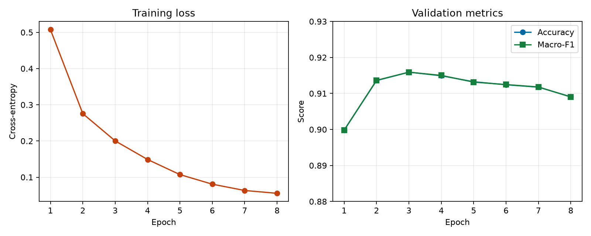
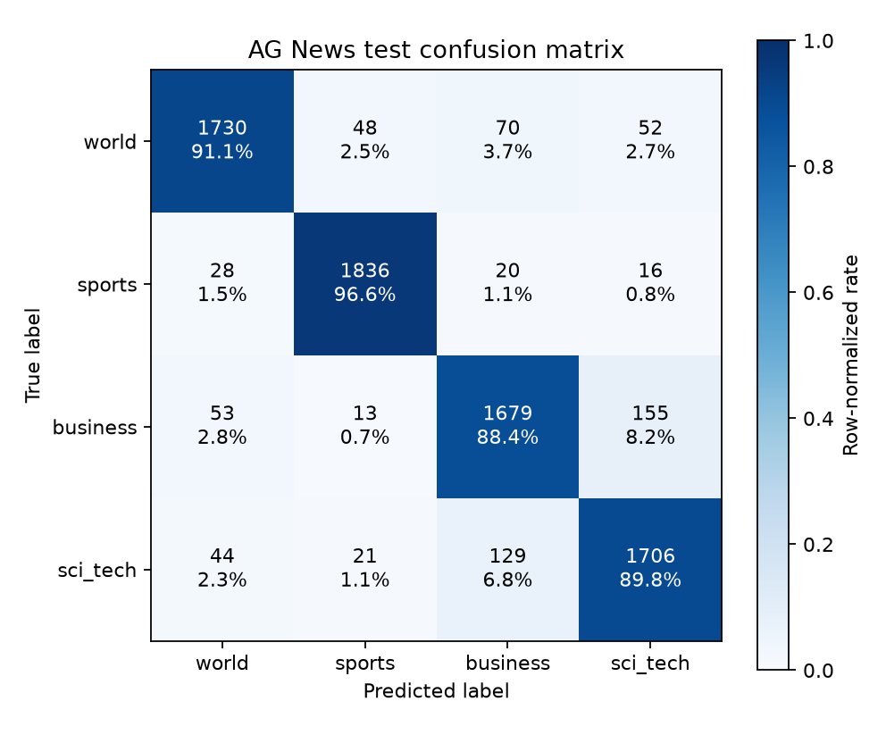

# PyTorch 文本分类实践

[](LICENSE)
[](pyproject.toml)
[](.github/workflows/ci.yml)

**English: [README.md](README.md)**

这是一个面向初学者、强调实验可复现性的 PyTorch 文本分类项目。项目以 AG News 为参考任务，同时支持带表头的通用 CSV 二分类和多分类数据，完整展示数据准备、审计、分层划分、训练集词表、动态 padding、经典模型、GPU 训练、评估、错误分析和 checkpoint 续训。

```text
download -> prepare -> inspect -> dry run -> train -> evaluate -> predict
```

当前内置 `embedding_bag`、`text_cnn` 和 `bilstm`，并提供 `ag_news` 与 `generic_csv` 两个数据 adapter。项目聚焦单标签经典文本分类；目前不支持多标签、预训练 Transformer 或生产部署。

## 已完成的 Kaggle 训练

项目已在 Kaggle Tesla T4 上完成 TextCNN 的 8 轮 AG News 训练，并使用最佳验证轮次一次性评估测试集。

| 项目 | 结果 |
| --- | ---: |
| 训练 / 验证 / 测试 | 108,000 / 12,000 / 7,600 |
| 最佳验证 macro-F1 | **0.915909** |
| 测试 accuracy | **0.914605** |
| 测试 macro-F1 | **0.914610** |
| Kaggle 总耗时 | 151.3 秒 |





这是一组有明确数据、配置和环境边界的真实运行记录，不是通用基准。配置、tokenizer、逐轮指标、环境、混淆矩阵和 649 个错误样本见[参考运行](docs/recorded-run/kaggle-agnews-textcnn/README.zh-CN.md)。

## 从全新克隆开始

需要 Python 3.10-3.12 和 [uv](https://docs.astral.sh/uv/)。以下命令从仓库根目录执行：

```bash
git clone https://github.com/Doithoo/pytorch-text-classification-lab.git
cd pytorch-text-classification-lab
uv sync --locked --extra dev
uv run python scripts/download_data.py --data-dir data/raw
uv run text-classify prepare-data --config configs/learning_minimal.yaml
uv run text-classify inspect-data --config configs/learning_minimal.yaml
uv run text-classify train --config configs/learning_minimal.yaml --dry-run --set device=cpu
```

`--dry-run` 只完成一个 batch 的前向、损失和反向传播，不创建运行目录。继续完成一次小样本 CPU 训练与评估：

```bash
uv run text-classify train --config configs/learning_minimal.yaml \
  --set device=cpu --set run_name=first-run
uv run text-classify evaluate --checkpoint artifacts/first-run/best.pt \
  --manifest-dir data/manifests --device cpu
uv run text-classify predict --checkpoint artifacts/first-run/best.pt \
  --text "Stocks rose after the company reported strong earnings." --top-k 3
```

使用自己的 `text,label` CSV 时，从[自定义数据指南](docs/guides/using-your-data.zh-CN.md)和 `configs/generic_csv_example.yaml` 开始。`inspect-data` 会生成包含重复文本、跨 split 泄漏、标签冲突、截断和 OOV 的 `inspection.json`。批量预测和实验比较使用：

```bash
uv run text-classify predict-file --checkpoint artifacts/first-run/best.pt \
  --input texts.csv --output predictions.jsonl
uv run text-classify compare-runs artifacts/run-a artifacts/run-b
```

正常训练会保存最终配置、tokenizer、`best.pt`、`last.pt`、逐轮指标和运行身份。训练 checkpoint 基于 Python pickle，只加载你信任的文件；对外推理分发可用 `export-inference` 转为 `.safetensors`。

## 三模型对比结果

当前代码的同协议 Kaggle 运行已完成，结果与证据见[三模型对比参考运行](docs/recorded-run/kaggle-agnews-model-comparison-v0.3.0/README.zh-CN.md)：

| 模型 | Test accuracy | Test macro-F1 |
| --- | ---: | ---: |
| BiLSTM | **0.916053** | **0.915985** |
| EmbeddingBag | 0.915395 | 0.915278 |
| TextCNN | 0.910132 | 0.910090 |

这三行共享 manifest、tokenizer、seed、训练预算和 Tesla T4；旧 TextCNN 记录仍保留为历史 revision 证据。

不要求本地 CUDA。安装并登录 Kaggle CLI 后，按[Kaggle 训练指南](docs/guides/kaggle.zh-CN.md)修改 Kernel 用户名并提交：

```bash
uv tool install kaggle
kaggle auth login
kaggle kernels push -p docs/recorded-run/kaggle
```

runner 会自动下载代码和 AG News、准备 manifest、dry run、CUDA 训练并评估测试集。Kaggle 临时磁盘会清理，运行完成后必须下载 `artifacts/`。

## 文档

从[文档首页](docs/README.zh-CN.md)按目标进入；启用 GitHub Pages 后，同一 Markdown 由 MkDocs 发布到 `https://doithoo.github.io/pytorch-text-classification-lab/`：

- [教程](docs/tutorial/README.zh-CN.md)：基础、环境、数据、模型、训练、评估与推理。
- [概念](docs/concepts/classification-flow.zh-CN.md)：完整数据流、代码导览和配置合并。
- [指南](docs/guides/choosing-models.zh-CN.md)：模型选择、实验、排错、Kaggle 和扩展方式。
- [参考](docs/reference/config-reference.zh-CN.md)：配置、数据格式、指标、checkpoint、CLI 和模型清单。
- [目录说明](configs/README.zh-CN.md)：配置、示例、脚本和测试的可运行入口。

AG News 的来源、引用和数据许可边界见[数据集说明](docs/reference/ag-news.zh-CN.md)。

## 开发

```bash
uv sync --locked --extra dev
uv run ruff check .
uv run ruff format --check .
uv run mypy
uv run pytest -W error::DeprecationWarning
uv build
uv run twine check dist/*
```

行为修改必须带测试，双语文档应保持语义一致。贡献前请阅读[贡献指南](CONTRIBUTING.zh-CN.md)、[安全策略](SECURITY.md)和[变更记录](CHANGELOG.md)。项目代码采用 [MIT License](LICENSE)。
